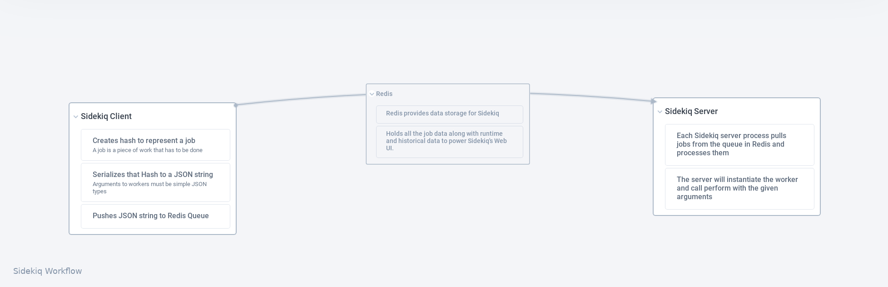

# reimagined-octo-doodle
A Ruby-Sinatra project that does nothing but explore the world of sidekiq

## Sidekiq

## Running the Sidekiq Server
~~~~
bundle exec sidekiq -r ./worker.rb
~~~~

## Running the Sinatra Application
~~~~
ruby web.rb -p 21810
~~~~

## Executing Jobs from IRB
~~~~
bundle exec irb -r ./worker.rb
irb(main):001:0> OurWorker.perform_async("easy")
=> "abb9ad4a40082b873d609342"
irb(main):002:0> OurWorker.perform_in(5,"easy")
=> "d4f4bf52c1cb6c157d683c60"
~~~~
